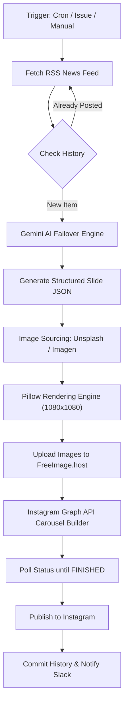

# 🚀 Instagram Tech News Automation Bot

An end-to-end autonomous pipeline that fetches trending technology & AI news, generates structured multi-slide content using Gemini AI, sources high-resolution imagery via Unsplash and Imagen, renders ultra-clean professional carousel slides, and automatically posts to Instagram.

---

## 📋 Table of Contents
- [Features](#-features)
- [How It Works (Architecture Pipeline)](#-how-it-works-architecture-pipeline)
- [Adaptive Slide Layout Types](#-adaptive-slide-layout-types)
- [Configuration & GitHub Secrets](#-configuration--github-secrets)
- [Automation Triggers & Schedule](#-automation-triggers--schedule)
- [Local Setup & Testing](#-local-setup--testing)
- [Repository Structure](#-repository-structure)

---

## ✨ Features

- **📰 Smart News Ingestion**: Automatically parses tech feeds (e.g., TechCrunch) and prevents posting duplicates using persistent history tracking (`used_news.txt`).
- **🔑 Dual API Key & Multi-Model Failover**: Automatically cycles between `GEMINI_API_KEY` and `GEMINI_API_KEY_2` across multiple Gemini models (`gemini-2.5-flash`, `gemini-2.0-flash`, etc.) to handle rate limits (429 / quota exhaustion) seamlessly.
- **🎨 Premium Adaptive Layout Engine**:
  - Dynamically renders between 3 to 7 slides per carousel.
  - Auto-scaling headline font sizing so long text never overflows or clips.
  - Clean vertical centering and safe-zone margin enforcement (1080×1080 square format).
  - Rich typography using Google Fonts (Roboto Black / Bold / Medium) with gold (`#EBCB6B`) accent highlighting.
- **🖼️ Multi-Tiered Image Sourcing**:
  1. High-resolution relevant photos from **Unsplash API**.
  2. AI-generated background fallback via **Imagen 3**.
  3. Clean dark canvas template fallback if APIs are unavailable.
- **📱 Instagram Graph API Publishing**:
  - Uploads generated slides to image hosting.
  - Creates an Instagram Carousel container.
  - Polls backend processing until `FINISHED`.
  - Publishes the post directly to the Instagram Business Account.
- **🔔 Slack Notifications & State Persistence**:
  - Posts success alerts to a Slack channel via Webhooks.
  - Commits updated history files (`used_news.txt` & `used_images.txt`) back to Git automatically.

---

## ⚙️ How It Works (Architecture Pipeline)



1. **Trigger**: Scheduled twice daily (7:00 AM & 7:00 PM IST), on GitHub Issue creation, or manual dispatch.
2. **News Fetching**: Parses the latest TechCrunch feed entries and filters out previously published headlines recorded in `used_news.txt`.
3. **AI Content Generation**: Prompts Gemini to summarize the news into a cohesive post, choosing 3 to 7 structured slides with specific layout types (`cover`, `context`, `bullets`, `stat`, `quote`, `comparison`, `cta`).
4. **Media Fetching**: Downloads background images based on Gemini's search queries. Tracks image URLs in `used_images.txt` to avoid visually repeating photos.
5. **Slide Rendering**: Pillow (PIL) draws high-contrast text, gold accent bars, wrapped typography, and slide counters (`01/05`) onto a 1080×1080 canvas.
6. **Publishing**: Uploads rendered slide images, constructs an Instagram carousel, waits for status completion, and publishes.
7. **Persistence**: Saves state back to the Git repository and sends a Slack webhook notification.

---

## 📐 Adaptive Slide Layout Types

The layout engine supports 7 distinct adaptive slide designs:

| Layout Type | Description & Elements | Alignment |
|-------------|------------------------|-----------|
| **`cover`** | Main entry slide. Large headline with gold highlighted key terms, gold accent line, and subtext description. | Left-aligned |
| **`context`** | Background or question intro. Clean centered headline with subtle separator line and subtext. | Centered |
| **`bullets`** | Bulleted list slide. Centered headline, horizontal separator line, and gold bullet points (`•`). | Centered HL / Left Bullets |
| **`stat`** | Data visualization slide. Small context label (`Key figure`), large gold stat number (auto-scaled), gold accent bar, and description. | Left-aligned |
| **`quote`** | Highlighting key statements or official quotes. Italic quote text, gold line, and attribution (`— Name, Title`). | Centered |
| **`comparison`** | Two-column side-by-side comparison (`BEFORE` vs `AFTER`) separated by a vertical gold divider line. | Two Columns |
| **`cta`** | Engagement / final slide. Framed with top & bottom gold lines, headline question, and call to action. | Centered |

---

## 🔑 Configuration & GitHub Secrets

Configure the following secrets in your GitHub Repository under **Settings → Secrets and variables → Actions**:

| Secret Name | Required | Description |
|-------------|----------|-------------|
| `GEMINI_API_KEY` | **Yes** | Primary Google Gemini API key. |
| `GEMINI_API_KEY_2` | Optional | Secondary Gemini API key for automatic quota/rate-limit failover. |
| `UNSPLASH_ACCESS_KEY` | **Yes** | Unsplash API Access Key for downloading background photos. |
| `IG_ACCESS_TOKEN` | **Yes** | Long-lived Instagram Graph API access token. |
| `IG_ACCOUNT_ID` | **Yes** | Instagram Business Account ID. |
| `SLACK_WEBHOOK_URL` | Optional | Slack Webhook URL for posting success notifications. |

---

## ⏰ Automation Triggers & Schedule

The workflow `.github/workflows/post.yml` runs on three triggers:

1. **Cron Schedule**: Runs automatically twice a day at **01:30 UTC & 13:30 UTC** (7:00 AM & 7:00 PM IST).
2. **Issue Opened**: Opening a GitHub Issue (e.g., via Slack `/github open`) triggers an instant post creation. Once posted, the bot automatically closes the issue.
3. **Manual Dispatch**: Can be manually run anytime via **Actions → Publish Tech News Post → Run workflow**.

---

## 💻 Local Setup & Testing

### Prerequisites
- Python 3.10+
- Roboto Fonts installed (or system Arial fallback)

### Step-by-Step

1. **Clone the repository**:
   ```bash
   git clone https://github.com/sanjay032007/instagram-tech-bot.git
   cd instagram-tech-bot
   ```

2. **Install dependencies**:
   ```bash
   pip install -r requirements.txt
   ```

3. **Set Environment Variables**:
   - **Linux / macOS**:
     ```bash
     export GEMINI_API_KEY="your_gemini_key"
     export GEMINI_API_KEY_2="your_second_gemini_key"
     export UNSPLASH_ACCESS_KEY="your_unsplash_key"
     export IG_ACCESS_TOKEN="your_ig_token"
     export IG_ACCOUNT_ID="your_ig_account_id"
     ```
   - **Windows (PowerShell)**:
     ```powershell
     $env:GEMINI_API_KEY="your_gemini_key"
     $env:GEMINI_API_KEY_2="your_second_gemini_key"
     $env:UNSPLASH_ACCESS_KEY="your_unsplash_key"
     $env:IG_ACCESS_TOKEN="your_ig_token"
     $env:IG_ACCOUNT_ID="your_ig_account_id"
     ```

4. **Run the automation script**:
   ```bash
   python main.py
   ```

---

## 📁 Repository Structure

```
.
├── .github/
│   └── workflows/
│       └── post.yml         # GitHub Actions workflow definition
├── main.py                  # Core automation script (fetching, AI, rendering, posting)
├── requirements.txt         # Python dependencies
├── used_news.txt            # Persistent log of posted article titles (auto-updated)
├── used_images.txt          # Persistent log of downloaded image URLs (auto-updated)
└── README.md                # Project documentation
```

---
